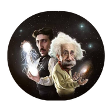
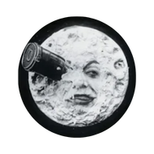

[Volver al inicio](index.html)
# ¿Quién soy?

Mi nombre es Luis Alberto Figueroa Muñoz, a la fecha (septiembre del 2026), soy un joven de 16 años y dedico la mayor parte del tiempo a mis estudios en el bachillerato. Me considero alguien centrado en sus objetivos, pero a la vez espontáneo; creo firmemente que en la vida siempre hay que dejar un espacio para las sorpresas, y lo sumamente meticuloso me resulta aburrido y ajeno, aunque, sí que hay algo que me queda más que claro: quiero ser físico y dejar huella en la ciencia, por lo que muchos de mis objetivos se encaminan hacia ello.

Claro que, mi vida no es (ni pretendo hacerla) solo un proyecto académico, eso me resultaría nefasto, pues también soy mis actividades de ocio y mis espacios de convivencia con los demás y conmigo mismo. Soy alguien equilibrado, y eso me parece mi virtud más feliz.

# Gustos
 Hace un año comencé a practicar Karate-Do gracias a mi escuela, y desde entonces, más que un deporte, se ha convertido en una pasión y un alivio, en una actividad que fluctúa entre hacerme entrar y salir de mi zona de confort, algo que valoro mucho. Gracias al Karate he desarrollado disciplina, me he mantenido saludable, he superado miedos arraigados y he conectado con personas nuevas, por ello, esta disciplina tiene un lugar importante en mí.

Como comenté antes, me apasiona la física, tanto que he decidido convertirla en mi profesión a futuro. A pesar de que no creo poseer un talento especial para las matemáticas, encuentro una belleza particular en el comportamiento natural de las cosas, de la materia, y me fascina todo lo que podemos hacer con los conocimientos fundamentales. Me entusiasma poder participar en ello algún día, investigando, encontrando patrones y transmitiendo mi conocimiento.

El ocio no se queda atrás en mi lista de gustos, pues soy un gran amante de los videojuegos, en especial los RPG; títulos como Persona 5 Royal, Expedition 33 y Genshin Impact me han marcado, aunque también me gustan otros géneros, como las novelas visuales, de las cuales he jugado la saga de Danganronpa y Mystic Messenger, o los Battle-Royale como Fortnite, pero sin duda mi favorito es y siempre será Rocket League.

La cinematografía es mi expresión artística preferida; cuando está bien elaborada, produce un resultado singular y fascinante que causa un efecto único en cada espectador. Además de por bello, el cine me gusta por accesible, es una manera de comunicar un mensaje masivamente, y me deleito de ver qué tiene que decir cada director/a. Además, disfruto del cine porque es también la forma de arte preferida de una persona especial para mí, y compartir ese gusto nos une.

# Habilidades y destrezas
Me tengo por alguien con buenas habilidades de comunicación y redacción, las cuales he ido desarrollando con esfuerzo a lo largo de mi vida, además, me considero un buen maestro y hablo con vehemencia sobre los temas que me gustan. Por otra parte, aprendo rápido y soy un buen observador, me gusta examinar a detalle los objetos de conocimiento antes de hacer una pregunta en voz alta; por ejemplo, cuando estoy en clase de matemáticas y hay algo en el pizarrón que no entiendo, me quedo mirándolo, hago conjeturas y llego a la explicación por mi cuenta, diría que eso es una buena costumbre. Además, tengo buena destreza para las actividades físicas y deportivas, virtud que me ha permitido sobresalir en Karate-Do. Estas son algunas de mis aptitudes más destacadas, sé que con el transcurso del tiempo iré desarrollando más y fortaleceré las actuales.

# Expectativas de CAS
Me queda claro que para poder aprobar el componente de Creatividad, Actividad y Servicio del Programa del Diploma del Bachillerato Internacional no bastará con mis conocimientos ni habilidades actuales, estoy seguro de que esta asignatura me incitará a desarrollarme más allá de lo académico para poder convertirme en un ciudadano con valores globales, algo que respeto bastante. Espero que durante mi experiencia con el programa, pueda explorar de manera satisfactoria otros horizontes que me doten de nuevos paradigmas para poder apreciar el mundo de un modo más completo y con una mentalidad abierta al cambio.
